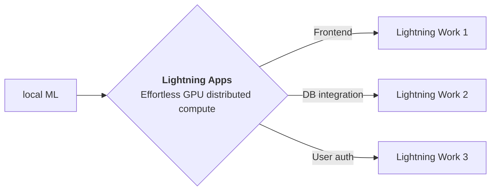

<div style="height: 90pt;"></div>
<div style="flex: 0 0 16%; margin-top: -10pt;">

</div>
<div style="flex: 0 0 65%; text-align: center;">
<h1 style="margin-bottom: 10pt;">Demo: Satellighte</h1>
<h2>A demo of Satellighte library using Lightning App</h2>
</div>
<div style="flex: 1">
    <div style="display: flex; align-items: center;">
        
        <div style="font-size: 0.9rem; margin-right: 5pt;"><a href="https://github.com/canturan10/" target="_blank">canturan10</a></div>
    </div>
    <div style="display: flex; align-items: center;">
        
        <div style="font-size: 0.9rem;"><a href="https://www.linkedin.com/in/canturan10/" target="_blank">@canturan10</a></div>
    </div>
</div>

--split--

# Satellite Image Classification

This app is a demo of [Satellighte Library](https://github.com/canturan10/satellighte). It showcases a notebook, a blog, and a model demo where you can upload photos to get a bounding box visualized output image.

You can fork this app and edit to customize according to your need.

> **Satellighte** is an image classification library  that consist state-of-the-art deep learning methods. It is a combination of the words **'Satellite'** and **'Light'**, and its purpose is to establish a light structure to classify satellite images, but to obtain robust results.

## Architectures

### MobileNetV2

**MobileNetV2** is a convolutional neural network architecture that seeks to perform well on mobile devices. It is based on an [inverted residual structure](https://paperswithcode.com/method/inverted-residual-block) where the residual connections are between the bottleneck layers.  The intermediate expansion layer uses lightweight depthwise convolutions to filter features as a source of non-linearity. As a whole, the architecture of MobileNetV2 contains the initial fully convolution layer with 32 filters, followed by 19 residual bottleneck layers.

### EfficientNet

**EfficientNet** is a convolutional neural network architecture and scaling method that uniformly scales all dimensions of depth/width/resolution using a compound coefficient. Unlike conventional practice that arbitrary scales these factors, the EfficientNet scaling method uniformly scales network width, depth, and resolution with a set of fixed scaling coefficients. The base EfficientNet-B0 network is based on the inverted bottleneck residual blocks of [MobileNetV2](https://paperswithcode.com/method/mobilenetv2), in addition to squeeze-and-excitation blocks.

### ResNet

**Residual Networks**, or **ResNets**, learn residual functions with reference to the layer inputs, instead of learning unreferenced functions. Instead of hoping each few stacked layers directly fit a desired underlying mapping, residual nets let these layers fit a residual mapping. They stack residual blocks ontop of each other to form network: e.g. a ResNet-50 has fifty layers using these blocks.

_For more information, please refer to the [Architectures](https://github.com/canturan10/satellighte/blob/master/satellighte/archs)_

<!-- DATASETS -->
## Datasets

- [EuroSAT](https://github.com/canturan10/satellighte/blob/master/satellighte/datasets/README.md#EuroSAT)
- [RESISC45](https://github.com/canturan10/satellighte/blob/master/satellighte/datasets/README.md)

_For more information, please refer to the [Datasets](https://github.com/canturan10/satellighte/blob/master/satellighte/datasets)_

<!-- DEPLOYMENTS -->
## Deployments

- [FastAPI](https://github.com/canturan10/satellighte/blob/master/deployment/README.md#fastapi)
- [ONNX](https://github.com/canturan10/satellighte/blob/master/deployment/README.md#onnx)
- [DeepSparse](https://github.com/canturan10/satellighte/blob/master/deployment/README.md#deepsparse)
- [TensorFlow](https://github.com/canturan10/satellighte/blob/master/deployment/README.md#tensorflow)
- [TensorFlow Lite](https://github.com/canturan10/satellighte/blob/master/deployment/README.md#tensorflow-lite)

_For more information, please refer to the [Deployment](https://github.com/canturan10/satellighte/blob/master/deployment)_

## Citations

<details>
  <summary>Click to expand!</summary>

```bibtex
@article{DBLP:journals/corr/ChengHL17,
  author    = {Gong Cheng and
               Junwei Han and
               Xiaoqiang Lu},
  title     = {Remote Sensing Image Scene Classification: Benchmark and State of
               the Art},
  journal   = {CoRR},
  volume    = {abs/1703.00121},
  year      = {2017},
  url       = {http://arxiv.org/abs/1703.00121},
  eprinttype = {arXiv},
  eprint    = {1703.00121},
  timestamp = {Mon, 02 Dec 2019 09:32:19 +0100},
  biburl    = {https://dblp.org/rec/journals/corr/ChengHL17.bib},
  bibsource = {dblp computer science bibliography, https://dblp.org}
}
```

```bibtex
@article{helber2019eurosat,
  title={Eurosat: A novel dataset and deep learning benchmark for land use and land cover classification},
  author={Helber, Patrick and Bischke, Benjamin and Dengel, Andreas and Borth, Damian},
  journal={IEEE Journal of Selected Topics in Applied Earth Observations and Remote Sensing},
  year={2019},
  publisher={IEEE}
}
```

```bibtex
@inproceedings{helber2018introducing,
  title={Introducing EuroSAT: A Novel Dataset and Deep Learning Benchmark for Land Use and Land Cover Classification},
  author={Helber, Patrick and Bischke, Benjamin and Dengel, Andreas and Borth, Damian},
  booktitle={IGARSS 2018-2018 IEEE International Geoscience and Remote Sensing Symposium},
  pages={204--207},
  year={2018},
  organization={IEEE}
}
```

```bibtex
@article{DBLP:journals/corr/abs-1801-04381,
  author    = {Mark Sandler and
               Andrew G. Howard and
               Menglong Zhu and
               Andrey Zhmoginov and
               Liang{-}Chieh Chen},
  title     = {Inverted Residuals and Linear Bottlenecks: Mobile Networks for Classification,
               Detection and Segmentation},
  journal   = {CoRR},
  volume    = {abs/1801.04381},
  year      = {2018},
  url       = {http://arxiv.org/abs/1801.04381},
  archivePrefix = {arXiv},
  eprint    = {1801.04381},
  timestamp = {Tue, 12 Jan 2021 15:30:06 +0100},
  biburl    = {https://dblp.org/rec/journals/corr/abs-1801-04381.bib},
  bibsource = {dblp computer science bibliography, https://dblp.org}
}
```

```BibTeX
@article{DBLP:journals/corr/abs-1905-11946,
  author    = {Mingxing Tan and
               Quoc V. Le},
  title     = {EfficientNet: Rethinking Model Scaling for Convolutional Neural Networks},
  journal   = {CoRR},
  volume    = {abs/1905.11946},
  year      = {2019},
  url       = {http://arxiv.org/abs/1905.11946},
  eprinttype = {arXiv},
  eprint    = {1905.11946},
  timestamp = {Mon, 03 Jun 2019 13:42:33 +0200},
  biburl    = {https://dblp.org/rec/journals/corr/abs-1905-11946.bib},
  bibsource = {dblp computer science bibliography, https://dblp.org}
}
```

```BibTeX
@article{DBLP:journals/corr/HeZRS15,
  author    = {Kaiming He and
               Xiangyu Zhang and
               Shaoqing Ren and
               Jian Sun},
  title     = {Deep Residual Learning for Image Recognition},
  journal   = {CoRR},
  volume    = {abs/1512.03385},
  year      = {2015},
  url       = {http://arxiv.org/abs/1512.03385},
  eprinttype = {arXiv},
  eprint    = {1512.03385},
  timestamp = {Wed, 17 Apr 2019 17:23:45 +0200},
  biburl    = {https://dblp.org/rec/journals/corr/HeZRS15.bib},
  bibsource = {dblp computer science bibliography, https://dblp.org}
}
```

</details>

--split--

# Lightning Apps

## Lightning Apps can be built for any AI use case, including AI research, fault-tolerant production-ready pipelines, and everything in between

!!! abstract "Key Features"

    - **Easy to use-** Lightning apps follow the Lightning philosophy- easy to read, modular, intuitive, pythonic and highly composable interface that allows you to focus on what's important for you, and automate the rest.
    - **Easy to scale**- Lightning provides a common experience locally and in the cloud. The Lightning.ai cloud platform abstracts the infrastructure, so you can run your apps at any scale. The modular and composable framework allows for simpler testing and debugging.
    - **Leverage the power of the community-** Lightning.ai offers a variety of apps for any use case you can use as is or build upon. By following the best MLOps practices provided through the apps and documentation you can deploy state-of-the-art ML applications in days, not months.



### Available at : `canturan10/Satellighte-Lightning-App/app.py`

```python
import lightning as L

poster_dir = "resources/poster"
blog = "https://canturan10.github.io/satellighte/"
github = "https://github.com/canturan10/satellighte"
tabs = ["Poster", "Blog", "Model Demo"]

app = L.LightningApp(
    ResearchApp(
        poster_dir=poster_dir,
        blog=blog,
        launch_gradio=True,
        tab_order=tabs,
    )
)
```

### Citation

```bibtex

@misc{Turan_satellighte,
  author={Turan, Oguzcan},
  title = {{satellighte}},
  url = {https://github.com/canturan10/satellighte}
}

```
